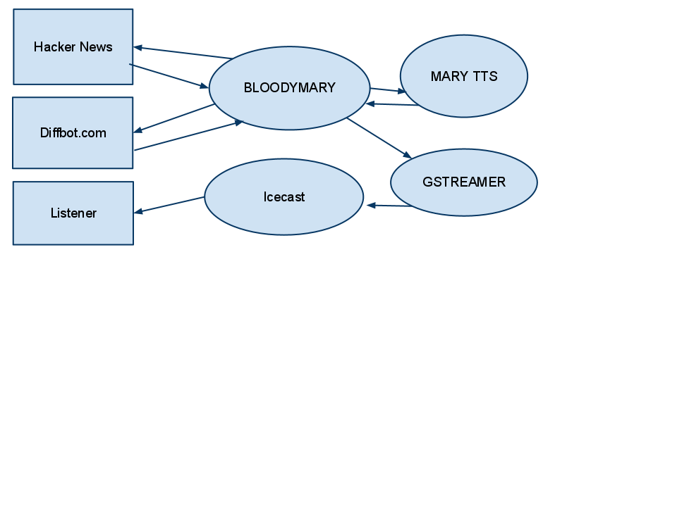

# Overview

---

# What is it?

A model for publishing audio streams from textual sources on the web. 

**More Specifically...**

- A processor that scrapes
  [news.ycombinator.com](http://news.ycombinator.com), converts text
  representation to synthesized speech and publishes audio streams.
- A website providing an embedded audio player and links to the
  published streams.

---

# Demo

---

# What software/services are used?

* [Clojure](http://clojure.org) is the glue binds it all
* [MARY TTS](http://mary.dfki.de) is an open-source, multilingual Text-to-Speech Synthesis platform written in Java.
* [gstreamer](http://gstreamer.freedesktop.org) is an open source multimedia framework.
* [gstreamer-java](http://code.google.com/p/gstreamer-java) is a Java interface to the gstreamer framework.
* [Icecast](http://www.icecast.org) is free server software for streaming multimedia.
* [Enlive](https://github.com/cgrand/enlive) is selector-based templating and transformation system for Clojure.
* [HTML5 BOILERPLATE](http://html5boilerplate.com) is the professional badass's base HTML/CSS/JS template for a fast, robust and future-proof site.
* [pynch](https://github.com/jeffsigmon/pynch) is a clojure library for scraping hacker news.
* [Diffbot Article API](http://www.diffbot.com) will extract and clean article text from news article web pages. 
* [diffbot-clj](https://github.com/yayitswei/diffbot-clj) Clojure client for Diffbot.
* [linode.com](linode.com) is a linux vps hosting provider.
* [tunein.com](http://tunein.com) gives you access to over 50,000 of the world's radio stations so you can find and listen to unlimited music, sports and talk radio.

---
# Context

---

# Data Flow Level 1

