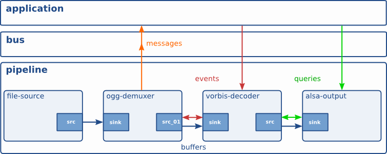

# gstreamer

---

# What is it?

gstreamer is a framework for creating streaming media applications. 

The fundamental design comes from the video pipeline at Oregon Graduate Institute, as well as some ideas from DirectShow.

** Specifically **

* API for multimedia applications
* Plugin architecture
* Pipeline architecture
* Mechanism for media type handling/negotiation
* Over 150 plug-ins
* A set of tools

---

# Context

---

# Core Concepts

* Element
* Pad
* Bin
* Pipeline
* Bus

---

# Data Flow

---

# Packages

* **gstreamer** contains the core library and elements
* **gst-plugins-base** contains an essential exemplary set of elements
* **gst-plugins-good** contains a set of good-quality plug-ins under our preferred license, LGPL
* **gst-plugins-ugly** contains a set of good-quality plug-ins that might pose distribution problems
* **gst-plugins-gl** contains plug-in and helper libraries for OpenGL integration
* **gst-ffmpeg** contains FFmpeg based plugin
* **tools** contains gst-launch, gst-inspect, gst-typefind, gst-feedback

--- 

# Key Elements for HNR

* appsrc
* auparse
* audioconvert
* tee
* lamemp3enc
* queue
* audioresample
* capsfilter
* shout2send
* vorbisend
* audiorate
* oggmux

---

# HNR Pipeline

--- 

# Demo

